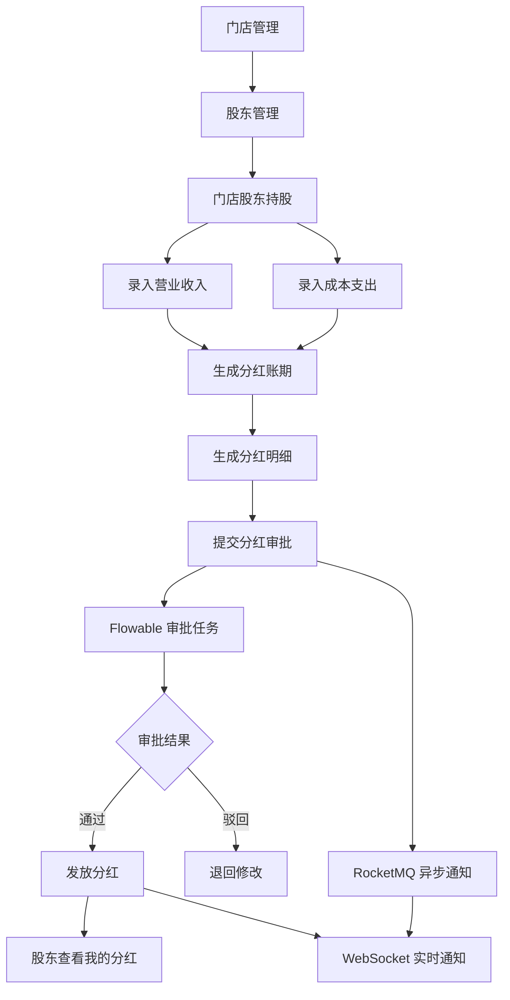
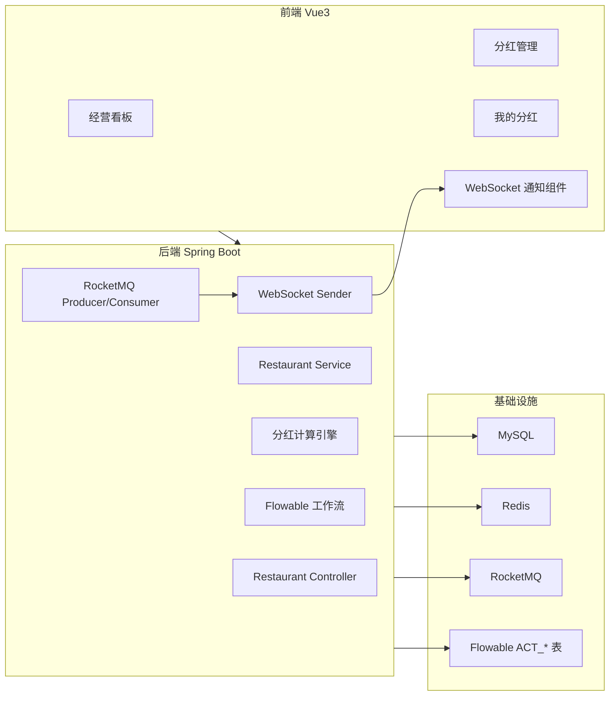

# 餐饮共享股东分红系统

由于原来的仓库是Gitee, 所以将项目迁移到GitHub
> 基于 **Yudao Boot 企业级后台底座** 二次开发的餐饮门店股东分红管理系统，聚焦餐饮门店合伙人持股、经营数据录入、利润核算、分红计算、审批发放、实时通知与经营看板


---

## 目录

- [项目介绍](#项目介绍)
- [项目定位](#项目定位)
- [为什么基于 Yudao 二次开发](#为什么基于-yudao-二次开发)
- [核心业务流程](#核心业务流程)
- [系统架构](#系统架构)
- [技术栈](#技术栈)
- [功能模块](#功能模块)
- [核心技术亮点](#核心技术亮点)
- [业务表设计](#业务表设计)
- [代码结构](#代码结构)
- [环境准备](#环境准备)
- [后端启动](#后端启动)
- [前端启动](#前端启动)
- [数据库初始化](#数据库初始化)
- [RocketMQ 配置](#rocketmq-配置)
- [Flowable 配置](#flowable-配置)
- [WebSocket 配置](#websocket-配置)
- [演示流程](#演示流程)
- [面试讲解重点](#面试讲解重点)
- [常见问题](#常见问题)
- [后续扩展](#后续扩展)
- [声明](#声明)

---

## 项目介绍

餐饮共享股东分红系统是一个面向餐饮门店合伙经营场景的财务分红管理平台。

现实业务中，一个餐饮品牌可能有多家门店，每家门店由多个股东共同出资经营。系统需要记录门店经营收入、成本支出、股东持股比例，并按账期自动计算利润和分红金额，同时支持审批、发放、通知和数据看板。

本项目围绕“餐饮门店股东分红”这个业务场景，完成了从经营数据录入到分红审批发放，再到股东个人查看分红的完整业务闭环。

---

## 项目定位

本项目不是简单 CRUD，也不是直接展示开源后台模板，而是：

```text
基于 Yudao Boot 企业级后台底座
        ↓
新增 yudao-module-restaurant 餐饮业务模块
        ↓
实现餐饮门店股东分红业务闭环
        ↓
接入数据权限、状态机、分布式锁、定时任务、Flowable、RocketMQ、WebSocket、ECharts 等企业级能力
```


## 为什么基于 Yudao 二次开发

本项目基于 Yudao Boot 二次开发，主要复用了成熟企业后台底座能力：

- 用户登录认证
- RBAC 角色权限
- 菜单权限
- 部门管理
- 多租户能力
- 数据字典
- 操作日志
- 定时任务
- Redis 基础能力
- WebSocket 基础能力
- Excel 导入导出能力
- 后端统一返回、异常处理、参数校验、分页封装

在企业真实开发中，业务系统通常不会从 0 重写用户、角色、菜单、权限、字典、日志、定时任务等通用能力，而是在公司已有中台 / 后台框架 / 脚手架基础上扩展业务模块。

因此本项目保留 Yudao 底座，并重点实现餐饮分红业务模块，更贴近真实企业二次开发场景。

> 面试时可以这样描述：本项目基于 Yudao Boot 企业级后台底座二次开发，保留权限、租户、字典、定时任务、WebSocket 等基础能力，我主要负责 `yudao-module-restaurant` 餐饮分红业务模块的设计与实现。

---

## 核心业务流程

### 业务闭环



### 分红计算流程

```text
门店收入 - 门店成本 = 门店利润
门店利润 * 可分红比例 = 可分红金额
可分红金额 * 股东持股比例 = 股东分红金额
```

系统会保存分红时的关键快照，例如：

- 股东名称快照
- 持股比例快照
- 门店利润快照
- 可分红金额快照
- 分红金额快照

这样即使后续股东名称、持股比例或门店信息发生变化，历史分红账期仍然可以追溯。

---

## 系统架构



---

## 技术栈

### 后端

| 技术 | 说明 |
|---|---|
| Java 17 | 后端开发语言 |
| Spring Boot 3.x | 后端主框架 |
| Spring MVC | RESTful 接口 |
| Spring Security | 登录认证与权限校验 |
| MyBatis Plus | ORM 与分页查询 |
| MySQL 8.x | 业务数据存储 |
| Redis / Redisson | 缓存、分布式锁 |
| Flowable | 分红审批工作流 |
| RocketMQ | 异步通知解耦 |
| WebSocket | 实时通知 |
| EasyExcel | Excel 导入导出 |
| Quartz / 定时任务 | 自动生成分红账期 |
| BigDecimal | 金额精度计算 |

### 前端

| 技术 | 说明 |
|---|---|
| Vue 3 | 前端框架 |
| TypeScript | 类型约束 |
| Element Plus | UI 组件库 |
| Vite | 前端构建工具 |
| Pinia | 状态管理 |
| ECharts | 经营看板图表 |
| WebSocket | 实时消息接收 |

---

## 功能模块

### 1. 经营看板

展示餐饮经营核心指标：

- 总收入
- 总成本
- 利润金额
- 可分红金额
- 已发放分红
- 待发放分红
- 收入 / 成本 / 利润趋势
- 门店利润排行
- 股东分红排行
- 账期状态统计

### 2. 门店管理

管理餐饮门店基础信息：

- 门店名称
- 门店编号
- 门店状态
- 开业时间
- 所属部门
- 负责人
- 联系方式

门店通过 `dept_id` 接入部门和数据权限体系，为后续门店级数据隔离提供基础。

### 3. 股东管理

管理股东基础信息：

- 股东姓名
- 手机号
- 身份信息
- 关联系统用户
- 所属部门
- 启用状态

股东可以绑定系统用户，用于股东端“我的分红”功能。

### 4. 门店股东持股

维护门店和股东之间的持股关系：

- 门店
- 股东
- 持股比例
- 出资金额
- 入股时间
- 退出时间
- 持股状态

支持股东退出机制。退出后保留历史数据，不直接删除，避免影响历史分红追溯。

### 5. 营业收入

录入门店营业收入：

- 门店
- 收入日期
- 收入类型
- 收入金额
- 状态确认
- 备注

收入确认后参与分红计算。

### 6. 成本支出

录入门店成本支出：

- 门店
- 成本日期
- 成本类型
- 成本金额
- 状态确认
- 备注

成本确认后参与利润计算。

### 7. 分红账期

按门店和月份生成分红账期：

- 账期月份
- 门店
- 总收入
- 总成本
- 利润金额
- 可分红金额
- 账期状态

支持手动生成、定时生成、审批、发放等状态流转。

### 8. 分红明细

按股东持股比例生成分红明细：

- 分红账期
- 门店
- 股东
- 持股比例快照
- 利润金额快照
- 分红金额
- 发放状态
- 发放时间

### 9. Flowable 分红审批

分红账期提交审批后，会启动 Flowable 流程实例，生成审批任务。

支持：

- BPMN 流程定义
- 流程实例
- UserTask 审批任务
- 动态候选审批人
- 审批通过
- 审批驳回
- 流程变量
- 历史流程记录
- 业务状态回写

### 10. RocketMQ 异步通知

分红审批、审批结果、分红发放、导入完成等通知事件通过 RocketMQ 异步处理。

通知链路：

```text
业务事件 -> RocketMQ Producer -> Topic -> Consumer -> WebSocket 推送
```

### 11. WebSocket 实时通知

前端全局通知组件监听后端 WebSocket 消息：

- 分红审批待处理
- 审批通过
- 审批驳回
- 分红已发放
- Excel 导入完成

### 12. 我的分红

股东个人端功能，当前登录用户只能查看自己绑定股东身份的数据：

- 我的分红汇总
- 我的持股门店
- 我的历史分红明细
- 已发放 / 待发放金额

后端不接收前端传入的 `shareholderId`，而是根据当前登录用户反查股东身份，避免越权查看其他股东分红。

### 13. 餐饮操作日志

记录关键业务操作：

- 分红生成
- 分红确认
- 提交审批
- 审批通过
- 审批驳回
- 分红发放
- 股东退出

用于财务审计和问题追溯。

---

## 核心技术亮点

### 1. 分红计算引擎

使用 BigDecimal 进行金额计算，避免浮点精度问题。

特点：

- 收入、成本、利润统一使用 BigDecimal
- 分红金额按持股比例计算
- 保留历史快照
- 支持尾差处理
- 防止重复生成账期

### 2. 账期状态机

分红账期不是简单 CRUD，而是通过状态机控制流转：

```text
已生成 -> 已确认 -> 审批中 -> 审批通过 -> 已发放
                         ↓
                       审批驳回
```

不同状态下限制不同操作，避免非法发放、重复审批、重复生成。

### 3. Redis 分布式锁

分红生成涉及金额和账期数据，不能重复生成。

系统通过 Redis / Redisson 分布式锁控制：

- 手动生成防重复点击
- 定时任务防并发执行
- 同门店同月份防重复生成

### 4. 定时任务自动生成分红

支持每月自动生成上月分红账期。

定时任务默认可以配置为暂停，演示时可手动触发，避免初始化环境中自动执行导致数据混乱。

### 5. Flowable 工作流审批

分红审批接入 Flowable：

- 提交审批时启动流程实例
- 动态设置候选审批人
- 审批人完成 UserTask
- 通过流程变量控制通过 / 驳回分支
- 流程结束后回写业务表

### 6. RocketMQ 异步通知

通知事件从主业务流程中解耦。

主业务只负责提交通知事件，真正的推送由 Consumer 异步处理。

同时支持事务提交后发送 MQ，避免业务回滚后仍发送通知。

### 7. WebSocket 实时通知

Consumer 消费 MQ 后调用 WebSocket 发送器，把消息实时推送给在线用户。

前端全局组件统一接收 `restaurant-notify` 消息并弹窗提醒。

### 8. 股东退出与历史保护

股东退出门店后，不直接删除持股关系，而是记录退出时间和状态。

历史分红账期继续保留退出前的持股快照，保证财务数据可追溯。

### 9. 我的分红防越权设计

“我的分红”接口不信任前端传入股东 ID，而是从登录用户反查绑定股东，保证股东只能查看自己的分红数据。

### 10. 经营看板 ECharts 可视化

通过 ECharts 展示门店经营数据，让面试演示更直观。

---

## 业务表设计

核心业务表：

| 表名 | 说明 |
|---|---|
| `restaurant_store` | 门店表 |
| `restaurant_shareholder` | 股东表 |
| `restaurant_store_shareholder` | 门店股东持股关系表 |
| `restaurant_revenue` | 营业收入表 |
| `restaurant_cost` | 成本支出表 |
| `restaurant_dividend_period` | 分红账期表 |
| `restaurant_dividend_detail` | 分红明细表 |
| `restaurant_dividend_approve_record` | 分红审批记录表 |
| `restaurant_operate_log` | 餐饮业务操作日志表 |

Flowable 表：

| 表前缀 | 说明 |
|---|---|
| `ACT_RE_*` | 流程定义 |
| `ACT_RU_*` | 运行时流程数据 |
| `ACT_HI_*` | 历史流程数据 |
| `ACT_GE_*` | 通用数据 |

---

## 代码结构

### 后端核心模块

```text
yudao-module-restaurant
└── src/main/java/cn/iocoder/yudao/module/restaurant
    ├── controller/admin       # 管理后台接口
    ├── service                # 业务逻辑
    ├── dal                    # 数据访问层
    ├── enums                  # 枚举和错误码
    ├── job                    # 定时任务
    ├── mq                     # RocketMQ 生产者和消费者
    ├── notify                 # WebSocket 通知
    ├── framework/flowable     # Flowable 工作流封装
    └── convert / vo / dto     # 数据转换和请求响应对象
```

### 前端核心目录

```text
src
├── api/restaurant             # 餐饮接口封装
├── views/restaurant           # 餐饮业务页面
│   ├── dashboard              # 经营看板
│   ├── store                  # 门店管理
│   ├── shareholder            # 股东管理
│   ├── storeShareholder       # 门店股东持股
│   ├── revenue                # 营业收入
│   ├── cost                   # 成本支出
│   ├── dividend               # 分红管理
│   └── myDividend             # 我的分红
└── components/RestaurantNotify # WebSocket 通知组件
```

---

## 环境准备

推荐环境：

| 环境 | 版本 |
|---|---|
| JDK | 17 |
| Maven | 3.8+ |
| MySQL | 8.x |
| Redis | 6.x / 7.x |
| Node.js | 18+ |
| pnpm | 8+ |
| RocketMQ | 4.x / 5.x |

---

## 后端启动

### 1. 修改配置

后端配置文件：

```text
yudao-server/src/main/resources/application-local.yaml
```

需要确认：

- MySQL 地址
- Redis 地址
- RocketMQ 地址
- Flowable 配置
- WebSocket 配置

### 2. 编译后端

```bash
cd yudao-boot-mini
mvn clean package -DskipTests
```

或者只编译餐饮模块：

```bash
mvn clean compile -pl yudao-module-restaurant -am -DskipTests
```

### 3. 启动后端

运行：

```text
YudaoServerApplication
```

默认后端地址：

```text
http://localhost:48080
```

---

## 前端启动

```bash
cd yudao-ui-admin-vue3
pnpm install
pnpm dev
```

默认前端地址：

```text
http://localhost:80
```

或根据 Vite 输出地址访问。

---

## 数据库初始化

### 新环境初始化

先执行 Yudao 原项目基础 SQL：

```sql
SOURCE sql/mysql/ruoyi-vue-pro.sql;
SOURCE sql/mysql/quartz.sql;
```

再执行餐饮模块 SQL：

```sql
SOURCE sql/mysql/restaurant/00_restaurant_all_for_fresh_db.sql;
```

### 已有环境补丁

如果数据库已经存在餐饮表，不要直接重建表。可以按需执行：

```sql
SOURCE sql/mysql/restaurant/01b_restaurant_existing_db_patch.sql;
SOURCE sql/mysql/restaurant/02_restaurant_dict.sql;
SOURCE sql/mysql/restaurant/03_restaurant_menu.sql;
SOURCE sql/mysql/restaurant/04_restaurant_job.sql;
SOURCE sql/mysql/restaurant/05_restaurant_demo_data.sql;
```

---

## RocketMQ 配置

如果启用 RocketMQ，配置：

```yaml
yudao:
  restaurant:
    mq:
      enabled: true

rocketmq:
  name-server: 127.0.0.1:9876
  producer:
    group: restaurant_notify_producer_group
```

通知 Topic：

```text
restaurant_notify_topic
```

Consumer Group：

```text
restaurant_notify_consumer_group
```

如果未启用 RocketMQ，系统可以降级为直接 WebSocket 推送。

---

## Flowable 配置

建议配置：

```yaml
flowable:
  database-schema-update: true
  async-executor-activate: false
  check-process-definitions: true
```

首次启动后，Flowable 会自动创建工作流表。

可检查流程定义：

```sql
SELECT ID_, KEY_, NAME_, VERSION_
FROM ACT_RE_PROCDEF
WHERE KEY_ = 'restaurantDividendApproveProcess';
```

---

## WebSocket 配置

建议配置：

```yaml
yudao:
  websocket:
    enable: true
    path: /infra/ws
    sender-type: local
```

前端监听消息类型：

```text
restaurant-notify
```

---

## 演示流程

推荐面试演示顺序：

1. 登录系统，进入经营看板
2. 展示收入、成本、利润、分红排行图表
3. 新增或查看门店
4. 新增或查看股东
5. 维护门店股东持股比例
6. 录入营业收入
7. 录入成本支出
8. 生成分红账期
9. 查看分红明细
10. 提交分红审批
11. Flowable 生成审批任务
12. 审批人通过 / 驳回
13. RocketMQ 异步通知
14. WebSocket 前端实时弹窗
15. 发放分红
16. 股东登录查看“我的分红”
17. 查看餐饮操作日志

---

## 面试讲解重点

可以按下面结构讲：

```text
1. 项目背景：餐饮门店合伙经营，需要对股东进行周期性利润分红
2. 技术选型：基于 Yudao Boot 二次开发，复用权限、租户、字典、定时任务等能力
3. 业务闭环：门店 -> 股东 -> 持股 -> 收入成本 -> 分红账期 -> 审批 -> 发放 -> 我的分红
4. 核心难点：金额精度、历史快照、状态机、防重复生成、审批流、异步通知、实时推送
5. 技术亮点：Flowable、RocketMQ、WebSocket、Redis 分布式锁、ECharts、数据权限
```

---

## 常见问题

### 1. 为什么项目里还有 Yudao 包名？

因为本项目是基于 Yudao Boot 企业级后台底座二次开发，保留 `cn.iocoder.yudao` 包名和基础模块可以降低改造风险，重点是新增餐饮业务模块。

### 2. 为什么“我的分红”没有数据？

需要当前登录用户绑定股东身份：

```sql
SELECT id, name, user_id
FROM restaurant_shareholder
WHERE user_id = 当前登录用户ID;
```

如果没有绑定，需要在股东管理中绑定系统用户。

### 3. 为什么接口 404？

优先检查：

- Controller 是否放在正确模块
- Maven 是否编译成功
- 后端是否重启
- 菜单组件路径是否正确
- 前端请求路径是否重复写了 `/admin-api`

### 4. 为什么 WebSocket 连接不上？

检查：

- 后端 WebSocket 是否启用
- 前端 token 是否存在
- `/infra/ws` 地址是否代理到后端
- 浏览器 Network -> WS 是否连接成功

### 5. 为什么 RocketMQ 启动失败？

检查：

- NameServer 是否启动
- Broker 是否启动
- `rocketmq.name-server` 地址是否正确
- `yudao.restaurant.mq.enabled` 是否开启

### 6. 为什么 Flowable 表不存在？

检查是否配置：

```yaml
flowable:
  database-schema-update: true
```

首次启动需要自动创建 `ACT_*` 表。

---

## 后续扩展

- 股东分红确认单 PDF 导出
- 门店经营月报
- 股东年度分红报表
- AI 经营分析
- 成本异常预警
- 移动端股东小程序
- 分红打款对接支付系统
- 多级审批流程
- 更细粒度的数据权限

---

## 声明

本项目基于 Yudao Boot 企业级后台底座进行二次开发，保留原项目的基础能力和开源协议说明。项目重点为 `yudao-module-restaurant` 餐饮共享股东分红业务模块，适用于学习、作品集展示和面试讲解。

如果用于公开仓库，请保留原项目相关开源协议，并在 README 中明确说明本项目是基于 Yudao Boot 二次开发。
